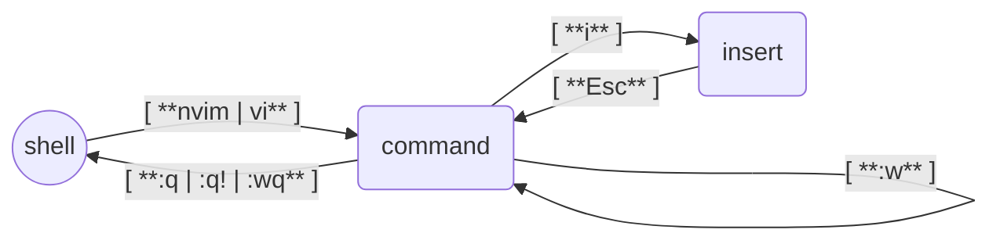

+++
title = "Essential Command-Line Tools for Linux: A Practical Guide"
date = 2025-11-23T13:09:22-03:00
[taxonomies]
tags = ['Applications', 'Debian', 'Alpine Linux', 'Termux']
series = ['Linux Playground From Scratch']
[extra]
add_toc = true
series = true
+++

So far, in previous posts, we have covered how to install and set up [Debian](https://www.debian.org/) and [Alpine](https://www.alpinelinux.org/) as Guest Operating Systems running in a Virtual Machine and also [Termux](https://termux.dev/en/) running in Android. In this post, we're going to review how to install some tools that might be useful to ease our work in our playground, development, or working environment. It's worth mentioning that some tools aren't available on all systems, so I'll notify you when this happens.


NeoVim {#neovim}
------

A text editor is definitely something you will need at some point. There are many options for command-line text editors available, but we will focus on [vi](https://en.wikipedia.org/wiki/Vi_%28text_editor%29), specifically on [neovim](https://neovim.io), an editor derived from [vim](https://www.vim.org), which is a clone of _vi_.

We're going to learn the very basics of this specific editor because the `vi` editor is part of the [list of POSIX commands](https://en.wikipedia.org/wiki/List_of_POSIX_commands). This means that you'll almost certainly find it in any POSIX-compatible OS you have to work with (learn once, apply everywhere).

Let's start by installing neovim. Below are the commands to do it on each of the systems we have reviewed in this series; pick the one that matches your needs.


:: Debian
```bash
sudo apt install neovim
```
:: Alpine
```bash
sudo apk add neovim
```
:: Termux
```bash
pkg install neovim
```


After the installation ends, it's time to open the editor. But before anything, you need to understand a little bit about how it works. The `vi` editor cycles between **modes**; most of the time, you will be in one of the **command** or the **insert** modes. When you open the editor, you'll be in the _command_ mode, where you'll be able to "command" the editor to do things like saving the changes, exiting, searching, search and replace, &c. On the other hand, the _insert_ mode will let us insert (write) content into the document.

To open the editor, you will write the `nvim` command. If you want to edit a file, you can pass the name of the file as an argument; the command would be something like `nvim /path/to/file_to_edit.txt`. If you want to use the `vi` or `vim` commands to access _NeoVim_, you can run the command below this paragraph. Then you could write something like `vi /path/to/file_to_edit.txt` to edit a file.

```bash
sudo ln -fs "$(which nvim)" /usr/bin/vi \
&& sudo ln -fs "$(which nvim)" /usr/bin/vim
```

If you see [weird characters appearing right after starting neovim](https://github.com/neovim/neovim/issues/9089), run the following command. It's a terminal emulator bug and has been described in the [FAQ](https://neovim.io/doc/user/faq.html).

```bash
mkdir -p ~/.config/nvim \
&& echo 'set guicursor=' >> ~/.config/nvim/init.vim
```

Next is an screenshot of the `nvim` welcome screen.

{{ internal_link(name="Neovim welcome screen", path="assets/20251123-vm-guest-os-install-apps/neovim_001.png") }}

Once it is open, you'll be in the _command_ mode, and you can switch to the _insert_ mode by pressing the `i` key, where you can insert text. Once you're done inserting text into the document, you can switch back to the _command_ mode by pressing the `Esc` key. Of course, you can switch back to the _insert_ mode with `i`, write more stuff, come again to the _command_ mode with `Esc`, and continue in this loop as long as you need it.

In the _command_ mode, you can save the changes to the file with the `:w<Enter>` command; the colon (`:`) tells the editor that you are going to write a command, and the `w` is for **write**. If you have started _vi_ without opening a file, you'll need to tell where do you want to write the content; you can do it with the command `:w /path/to/save_content.txt<Enter>`.

If you want to exit, you have to write the `:q<Enter>` command to **quit**. But, if there are changes that haven't been saved, you first will need to write them (`:w`) or you can exit without saving the changes with the `:q!<Enter>` command. The exclamation mark of the command (`!`) tells vi to force the command ignoring any warning.

Also, you can combine multiple operations in the same command. For example, if you want to write and exit, you can do it with the command `:wq<Enter>`.

Here is a small table with the very basic things we have just learned.

| Current Mode | Command       | Next Mode    | Description                                     |
|:-------------|---------------|:-------------|:------------------------------------------------|
| Shell (bash) | `nvim` / `vi` | Command      | Open the VI text editor                         |
| Command      | `i`           | Insert       | Start editing by entering the _insert_ mode     |
| Insert       | `Esc`         | Command      | Stop editing and switch back to _command_ mode  |
| Command      | `:w`          | Command      | Write changes                                   |
| Command      | `:q`          | Shell (bash) | Exit from the VI editor and return to the shell |
| Command      | `:q!`         | Shell (bash) | Exit without saving any change                  |
| Command      | `:wq`         | Shell (bash) | Write changes and exit                          |

And below a diagram representing the previous table.


:: dev,markdown

:: link_internal
{"name":"Neovim: Diagram","path":"assets/20251123-vm-guest-os-install-apps/neovim_002.png"}


While nowadays (almost) all keyboards have the arrow keys and you can move around the document using them, at the time the _vi_ editor was created the [keyboard didn't have these keys](https://en.wikipedia.org/wiki/Vi_%28text_editor%29#/media/File:KB_Terminal_ADM3A.svg) and that's why the editor supports the famous **hjkl** keys to move around the document. It is worth knowing these keys because they have become like a de facto standard. Probably you'll see applications that support the **vi mode**; this means that they support _vi's_ key combinations to move around (e.g., [vimium](https://github.com/philc/vimium), [vscodevim](https://github.com/VSCodeVim/Vim), [&c.](https://vim.reversed.top)).

Keep in mind that you'll use these keys to move around the document when you're in the _command_ mode. Otherwise, if you're in the _insert_ mode, you'll be inserting these keys in the document. Below is a table explaining the direction of each key.

| Key | Direction |
|:----|:----------|
| `h` | Left      |
| `j` | Down      |
| `k` | Up        |
| `l` | Right     |

Now you know enough to start editing files. Once you feel comfortable with this, I suggest you, as your next step, to do the interactive tutorial **Vim Tutor** that you can access by following the next instructions.


:: NeoVim

If you have installed **NeoVim**, the command to access the tutorial is the next one.

```bash
nvim +Tutor
```

Also, you can access the same tutorial by typing the `:Tutor` command inside NeoVim.

:: Vim

If you have installed **Vim** (instead of _NeoVim_), the command you need to type is the next one.

```bash
vimtutor
```


And, if you want more study material, below is a list of books that you can read to improve your expertise level.

* [Use Vim Like A Pro, by Tim Ottinger](https://leanpub.com/VimLikeAPro)
* [A Byte of Vim, by Swaroop C H](https://github.com/swaroopch/byte-of-vim) ([pdf](https://vim.swaroopch.com/byte-of-vim.pdf))
* [Learn Vimscript the Hard Way, by Steve Losh](https://learnvimscriptthehardway.stevelosh.com)
* [VIM User Manual](http://www.eandem.co.uk/mrw/vim/usr_doc/index.html)
* [UNIX Text Processing, by Dale Dougherty and Tim O'Reilly](https://www.oreilly.com/openbook/utp/)
* [... and more](https://iccf-holland.org/vim_books.html)


Git {#git}
---

Git is a tool commonly used in software development, but its use has spread to a wider area that includes other fields. For instance, it is increasingly used in [data science](https://github.com/ossu/data-science), design, content management, package management, among others. This is why, sooner or later, you might need it as a dependency of another tool or as an essential part of your work.

Below is the command that you need to run to install Git.


:: Debian
```bash
sudo apt install git
```
:: Alpine
```bash
sudo apk add git git-doc
```
:: Termux
```bash
pkg install git
```


Once the installation process ends, it is important to tell Git what your name and email are. These values are the minimum configuration that you'll need to set if you plan to use Git to track changes on your files.

Below is the command to set your name (update it with your real name).

```bash
git config --global user.name "Your Full Name"
```

And next is the command to set your email (also update it with your real email).

```bash
git config --global user.email "your@email.address"
```

Also, you can set NeoVim (installed in previous section) as Git's default editor with the following command.

```bash
git config --global core.editor "nvim"
```

That's all you need to know to get started. If you want to know a bit more about Git, typing the next command you can access a tutorial that will give you an introduction.

```bash
man gittutorial
```

And, if you are eager to learn more about Git, I really recommend you read the official [Pro Git book, written by Scott Chacon and Ben Straub](https://git-scm.com/book/).


Docker {#docker}
------

Docker is a tool that allows us to run [containers](https://en.wikipedia.org/wiki/Containerization_%28computing%29) with a simple and friendly user interface. I chose Docker because it has become the de facto standard. Anyway, keep in mind that there are other tools we can use to achieve the same tasks, like [podman](https://en.wikipedia.org/wiki/Podman).

**IMPORTANT**: The following instructions are just for **Debian**. If you are using **Alpine**, we have already covered how to install Docker in the [Install Alpine Linux](@/blog/2025/07/2025-07-07_-_vm-guest-os-alpine.en.md) post. While, if you are using **Termux**, we have covered how to install Docker's client application in the [Termux Install](@/blog/2025/07/2025-07-13_-_termux-android-linux.en.md) post, where you can use it to interact with a Docker server running on another machine.

Let's start by installing Docker by running the next command.


:: Debian
```bash
sudo apt install docker.io docker-compose
```
:: Alpine
Check [Docker installation in Alpine](@/blog/2025/07/2025-07-07_-_vm-guest-os-alpine.en.md#docker)
:: Termux
Check [Docker installation in Termux](@/blog/2025/07/2025-07-13_-_termux-android-linux.en.md#docker)


Next, we will need to set up our user so it can run Docker.


:: Debian
```bash
sudo usermod -aG docker $(whoami)
```
:: Alpine
**NOT AVAILABLE**
:: Termux
**NOT AVAILABLE**


You will need to log out and log in again for the assignment of the **docker** group to take effect.

Finally, let's run the following command to check the installation and setup.


:: Debian
```bash
docker run hello-world
```
:: Alpine
**NOT AVAILABLE**
:: Termux
**NOT AVAILABLE**


If everything is working fine, in the output, you should see something like below.

```
Unable to find image 'hello-world:latest' locally
latest: Pulling from library/hello-world
17eec7bbc9d7: Pull complete
Digest: sha256:54e66cc1dd1fcb1c3c58bd8017914dbed8701e2d8c74d9262e26bd9cc1642d31
Status: Downloaded newer image for hello-world:latest

Hello from Docker!
This message shows that your installation appears to be working correctly.

To generate this message, Docker took the following steps:
 1. The Docker client contacted the Docker daemon.
 2. The Docker daemon pulled the "hello-world" image from the Docker Hub.
    (amd64)
 3. The Docker daemon created a new container from that image which runs the
    executable that produces the output you are currently reading.
 4. The Docker daemon streamed that output to the Docker client, which sent it
    to your terminal.

To try something more ambitious, you can run an Ubuntu container with:
 $ docker run -it ubuntu bash

Share images, automate workflows, and more with a free Docker ID:
 https://hub.docker.com/

For more examples and ideas, visit:
 https://docs.docker.com/get-started/
```


TMUX  {#tmux}
----

Tmux is a [Terminal Multiplexer](https://en.wikipedia.org/wiki/Terminal_multiplexer). It allows you to create a session from which you can run several applications, detach from the session (allowing the applications to keep running in the background), and reattach to the session.

Tmux simplifies working with multiple applications simultaneously. You can switch between them with a keystroke, display them side by side, copy text from one app and paste it into another, &c. Think of it as a window manager for the terminal.

Below is the command you can use to install tmux.


:: Debian
```bash
sudo apt install tmux vlock
```
:: Alpine
```bash
sudo apk add tmux kbd-vlock
```
:: Termux
```bash
pkg install tmux
```


After the installation, let's see a simple example of how it works by starting a new session with the following command (`demo` is just an example, replace it with whatever name you prefer), where `new` is an alias for `new-session`.

```bash
tmux new -s demo
```

Once inside the new session, you'll see something like the next screenshot.

{{ internal_link(name="Tmux: new session", path="assets/20251123-vm-guest-os-install-apps/tmux_001.png") }}

Let's continue by listing the current directory's content.

```bash
ls -lha
```

Next, we're going to detach (leave) the session. To do this, press the keystroke combination `Ctrl+b d`. This means pressing the **Ctrl** key followed by **b** without releasing the **Ctrl** key (the `+` sign means that both keys are pressed at the same time). Then, release both keys and press **d**. You can also see this keystroke combination with the `C-b d` [notation](https://en.wikipedia.org/wiki/Control_key#Notation).

Detaching the session means that it will continue running in the background. You can check this by running the following command, where `ls` is an alias for `list-sessions`.

```bash
tmux ls
```

Now, return to the session by running the next command, where `a` is an alias for `attach` or `attach-session`.

```bash
tmux a -t demo
```

You will see the output of the `ls` command that we ran previously.

Because we have only one open window, you can close the session by running the `exit` command. Alternatively, you can force the session to close by running the next command.

```bash
tmux kill-session -t demo
```

That covers the very basics of tmux. Before moving forward with the introduction, I'm going to share a simple tmux configuration that you can save in the `~/.tmux.conf` file by running the following command.

```bash
cat > ~/.tmux.conf <<HEREDOC
# @file: ~/.tmux.conf
# ---------------------
# Config to mimic GNU/Screen
# https://www.gnu.org/software/screen/manual/html_node/Default-Key-Bindings.html

# Change prefix convination
unbind-key C-b
set -g prefix C-a

# Key bindings                                          # Defaults
bind-key C-c new-window                                 # c
bind-key C-n next-window                                # n
bind-key C-p previous-window                            # p
bind-key C-d detach                                     # d
bind-key A command-prompt -I "#W" "rename-window '%%'"  # ,
bind-key x lock-client
bind-key X lock-server # Uppercase

# Lock window
set -g lock-command vlock
set -g lock-after-time 0 # In seconds. 0 == never

# Set VI mode
set-window-option -g mode-keys vi

# Mouse support
# @see https://github.com/tmux/tmux/issues/140#issuecomment-474341833
set -g mouse on
unbind-key -T copy-mode-vi MouseDragEnd1Pane

# Styles (https://man.openbsd.org/tmux#STYLES)
set -g status-bg default #black
set -g status-fg default #whie
set -g status-style "bg=default fg=default"
set -g status-left "#[fg=green][#[fg=default] #S@#h #[fg=green]][#[fg=default]"
set -g status-left-length 40
set -g status-right "#[fg=green]][#[fg=default] %Y-%m-%d %H:%M #[fg=green]]#[fg=default]"
set -g status-justify centre
set -g window-status-format " #I#{?window_flags,#{window_flags}, }#W "
set -g window-status-current-format "#[bold](#I#F#W)"
HEREDOC
```

If you start a new session, you'll see something like the next screenshot.

{{ internal_link(name="Tmux: applied configuration", path="assets/20251123-vm-guest-os-install-apps/tmux_002.png") }}

The first thing you'll notice in the previous configuration is that I've changed the default keystroke prefix combination from `C-b` to `C-a`. This is a nostalgic change, because `C-a` is the default keystroke prefix used by [screen](https://www.gnu.org/software/screen/) (another terminal multiplexer). Besides finding it easier to type, I wanted to have the same keystroke prefix on both apps.

Next, you'll see a list of key bindings explained in the following table. The bindings are case-sensitive; they won't work if a lowercase key is expected and you press the uppercase key (or vice versa).

| Keystroke Combination | Action                                                                |
|-----------------------|:----------------------------------------------------------------------|
| `C-a C-c`             | Create a new window                                                   |
| `C-a C-n`             | Move to the next window (to the right)                                |
| `C-a C-p`             | Move to the previous window (to the left)                             |
| `C-a C-d`             | Detach from current session                                           |
| `C-a A`               | Rename current window                                                 |
| `C-a x`               | Lock current client                                                   |
| `C-a X`               | Lock server                                                           |
| `C-a ?`               | Get a list of available keystroke combinations (exit by pressing `q`) |

After the previous bindings, you'll see that **VI** mode is enabled. This allows you to move around using the same keys that we learned with _vi_ (**hjkl**). You can use it in _copy mode_, explained in the next table.

| Keystroke Combination | Action                                               |
|-----------------------|:-----------------------------------------------------|
| `C-a [`               | Start copy mode                                      |
| `q`                   | Exit copy mode (without copying)                     |
| `hjkl`                | **VI** keys to move around the window (in copy mode) |
| `SPACE`               | Press the **Spacebar** to start the selection        |
| `ENTER`               | Press the **Enter** key to copy the selection        |
| `C-a ]`               | Paste the most recent selection that was copied      |

There are many other things that you can do with tmux, but they are beyond the scope of this introduction, such as pane management, scripting, automation, plugins, and extensions. To learn more about tmux, check the following resources:

* [The Tao of tmux](https://leanpub.com/the-tao-of-tmux/read)
* The official [Getting-Started](https://github.com/tmux/tmux/wiki/Getting-Started) wiki page
* [Learn X in Y minutes (Where X=tmux)](https://learnxinyminutes.com/tmux/)
* [`tmux.conf` With Commentary](https://willhbr.net/2024/03/06/tmux-conf-with-commentary/)


TTYD {#ttyd}
----

[TTYD](https://github.com/tsl0922/ttyd) is a tool that allows you to share your terminal over the network. This is useful if you don't have an SSH client to access the OS, but you do have a web browser. Another scenario where it could be helpful is sharing your terminal with teammates to show your work, for pair programming, or other collaborative tasks.

Below is the command to install ttyd.


:: Debian
```bash
curl --location --remote-name 'https://github.com/tsl0922/ttyd/releases/download/1.7.7/ttyd.i686' \
&& chmod a+x ttyd.i686 \
&& sudo mv ttyd.i686 /usr/bin/ttyd
```
:: Alpine
```bash
sudo apk add ttyd
```
:: Termux
```bash
pkg install ttyd
```


If you've installed ttyd in a virtual machine with a NAT network, remember to expose the port you'll use to access the service from the host machine.

Below is the command to start the ttyd service. This example uses port `4200`, but you can change it as desired. In Alpine don't use `sudo`.

```bash
sudo ttyd --port 4200 --writable login
```

Once the service is running, you can access the terminal using your web browser by navigating to [http://localhost:4200/](http://localhost:4200/).

As another example, you can attach to a **tmux** session (as shown in the previous section).

```bash
ttyd --port 4200 --writable tmux new -A -s demo
```

If you find the font size too small (or large), you can use the `fontSize` query parameter to adjust it, like this: [http://localhost:4200/?fontSize=20](http://localhost:4200/?fontSize=20).

For more information about using _ttyd_, consult the official [wiki](https://github.com/tsl0922/ttyd/wiki) page.

### Daemon

You might want ttyd to start automatically during the OS boot process. Here are the steps to automatically start the ttyd service when the system boots.


:: Debian

In Debian, we'll [create a systemd daemon](https://tuttlem.github.io/2018/02/03/create-a-systemd-daemon.html). First, create the `ttyd.service` file, which will contain the daemon configuration, using the following command.

```bash
cat <<EOF | sudo tee /lib/systemd/system/ttyd.service
[Unit]
Description=Share terminal over the web
After=network.target

[Service]
ExecStart=/usr/bin/ttyd --port 4200 --writable login
Restart=on-failure

[Install]
WantedBy=multi-user.target
Alias=ttyd.service
EOF
```

Then, run the following command to reload the available daemons and enable the one we just created.

```bash
sudo systemctl daemon-reload && \
sudo systemctl enable ttyd
```

Now you can start the service with the command below.

```bash
sudo systemctl start ttyd
```

And check the service status with the subsequent command.

```bash
sudo systemctl status ttyd
```

:: Alpine

In Alpine, we'll create an [OpenRC](https://wiki.alpinelinux.org/wiki/OpenRC) daemon using the next command.

```bash
cat <<EOF | sudo tee /etc/init.d/ttyd
#!/sbin/openrc-run

name="ttyd"
command="/usr/bin/ttyd"
command_args="--port 4200 --writable login"
command_background="yes"
pidfile="/run/ttyd.pid"


depend() {
    need net
}
EOF
```

Then, run the command below to enable the daemon.

```bash
sudo chmod +x /etc/init.d/ttyd && \
sudo rc-update add ttyd default
```

Once enabled, start it with the following command.

```bash
sudo rc-service ttyd start
```

And check the status with the next one.

```bash
sudo rc-service ttyd status
```

:: Termux

**NOT AVAILABLE**



### Similar Applications

- [upterm](https://github.com/owenthereal/upterm) ([package information](https://repology.org/project/upterm/information))
- [tty-share](https://github.com/elisescu/tty-share) ([package information](https://repology.org/project/tty-share/information))


CIFS (Shared Directory) {#cifs}
-----------------------

You'll likely need to share a directory between the host OS and the guest OS. For example, you might be working on a software project with the source code on the host OS, while development happens inside the guest OS. There are [different ways](https://en.wikipedia.org/wiki/Network_File_System) to [share files between host and guest](https://www.virtualbox.org/manual/topics/guestadditions.html#sharedfolders), but we'll review one commonly available on ~all~ most host OSs: the **SMB** ([Server Message Block](https://en.wikipedia.org/wiki/Server_Message_Block)) protocol.

Below, we'll see how to mount a shared directory from the host OS within the guest OS with read and write permissions. The shared directory will be in the format `//[SERVER_IP]/[SHARED_NAME]`. How to share a directory using the SMB protocol, including how to share with a username and password, is outside the scope of this post, but you can find plenty of documentation online.

**IMPORTANT**: The following instructions are for **Debian** and **Alpine** only. Termux is excluded because it cannot mount file systems at the kernel level, which [`cifs-utils`](https://wiki.samba.org/index.php/LinuxCIFS) requires. This limitation is due to Android's security model, which restricts apps from having the root-level access needed for kernel-level operations. However, Termux can act as our host OS, and we've already covered other methods to share a directory between Termux and a guest OS (Alpine) in a previous post.

Let's start by installing the `cifs` utilities (and enabling `netmount` on **Alpine**'s boot) with the following command.


:: Debian
```bash
sudo apt install cifs-utils
```
:: Alpine
```bash
sudo apk add cifs-utils \
&& sudo rc-update add netmount default
```
:: Termux
**NOT AVAILABLE**


To avoid repetition, we'll create variables to reuse in the following commands. These variables will store the server IP, the shared directory name, and the target directory (mount point). Update these values to suit your needs.

```bash
SMB_IP='10.0.2.2'
SMB_NAME='host-shared'
TARGET="${HOME}/shared"
```

Next, create the directory where the shared directory will be mounted.

```bash
mkdir "${TARGET}"
```

After creating the mount point directory, mount the shared directory using the following command. The `vers=1.0` parameter is needed [to mount cifs with unix extensions](https://askubuntu.com/questions/982266/how-to-mount-cifs-with-unix-extensions).

```bash
sudo mount -v -t cifs -o rw,guest,uid=$(id -u),forceuid,gid=$(id -g),forcegid,vers=1.0 "//${SMB_IP}/${SMB_NAME}" "${TARGET}"
```

To unmount the directory, run this command.

```bash
sudo umount "${TARGET}"
```

Manually mounting the shared directory every time it's needed can become tedious. To mount it automatically at boot time, save these mount settings in the `/etc/fstab` file. Here's the command to do so.

```bash
echo "//${SMB_IP}/${SMB_NAME} ${TARGET} cifs rw,guest,uid=$(id -u),forceuid,gid=$(id -g),forcegid,nofail,vers=1.0 0 0" | sudo tee -a /etc/fstab
```

With the previous configuration, you can also use the `mount` command with just the target mount point directory. Here's the shortest version of the `mount` command.

```bash
sudo mount "${TARGET}"
```


Fetch Tools {#fetch}
-----------

Here, we'll pick and install one of the many [fetch apps](https://beucismis.github.io/awesome-fetch/) available. Fetch apps provide system information like CPU, RAM, disk, and OS details.

I chose [macchina](https://github.com/Macchina-CLI/macchina) because it comes as a self-contained binary (making it easy to install) and is available for both `aarch64` and `x86_64` architectures.

Let's start by running the following command. It downloads the package with the binary and extracts it into the `~/.local/bin` directory. Ensure this directory is included in your `PATH` environment variable.

```bash
CURRENTWD=$(pwd) \
&& SYSARCH='aarch64' \
&& if [ "${SYSARCH}" != $(uname -m) ]; then SYSARCH='x86_64'; fi \
&& ORIGIN="https://github.com/Macchina-CLI/macchina/releases/download/v6.4.0/macchina-v6.4.0-linux-musl-${SYSARCH}.tar.gz" \
&& TARGET="macchina.tar.gz" \
&& mkdir -p ~/.local/bin \
&& cd ~/.local/bin \
&& if [ $(which curl) ]; then curl -L -o $TARGET $ORIGIN; else wget -O $TARGET $ORIGIN; fi \
&& tar -xzf $TARGET \
&& rm $TARGET \
&& cd $CURRENTWD
```

Then, download and set up a theme.

```bash
CURRENTWD=$(pwd) \
&& ORIGIN='https://github.com/Macchina-CLI/macchina/raw/refs/heads/main/contrib/themes/Hydrogen.toml' \
&& mkdir -p ~/.config/macchina/themes \
&& cd ~/.config/macchina/themes \
&& if [ $(which curl) ]; then curl -LO $ORIGIN; else wget $ORIGIN; fi \
&& cd $CURRENTWD \
&& cat <<HEREDOC >> ~/.config/macchina/macchina.toml
theme = "Hydrogen"
HEREDOC
```

Finally, run the command below to display your system's information.

```bash
macchina
```


GNU Typist {#gtypist}
----------

I've saved GNU Typist for last, as it's entirely optional. For those who primarily use a keyboard, this tool helps learn and improve typing skills. Here's an introduction from the [official page](https://www.gnu.org/software/gtypist/):

> **GNU Typist** (also called **gtypist**) is a universal typing tutor. You can learn correct typing and improve your skills by practising its exercises on a regular basis.

**IMPORTANT**: At the time of writing, the [package](https://repology.org/project/gtypist/information) for Alpine couldn't be found.

The command to install the application is below.


:: Debian
```bash
sudo apt install gtypist
```
:: Alpine
**NOT AVAILABLE**
:: Termux
```bash
pkg install gtypist
```


After installation, run the following command to start the lesson in Spanish (remove `esp.typ` for lessons in English).

```bash
gtypist esp.typ
```


Wrapping Up {#wrapping}
-----------

In this post, we explored installing and setting up several applications to simplify basic terminal tasks. While there are [thousands of CLI apps](https://github.com/toolleeo/awesome-cli-apps-in-a-csv), you'll discover them as needed. For now, you have plenty to start experimenting. Embrace the world of terminals and keyboards!

Take care and until next time!
