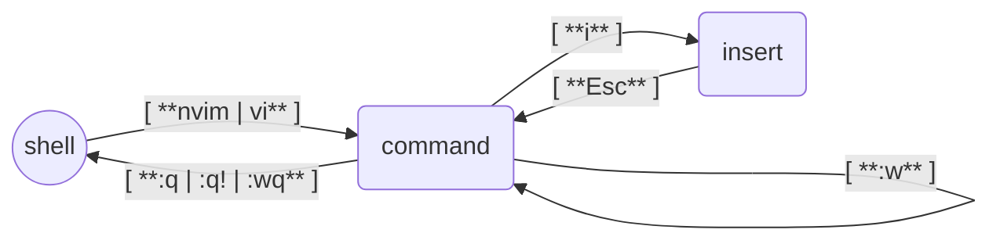

+++
title = "Herramientas Esenciales de Línea de Comandos para Linux: Una Guía Práctica"
date = 2025-11-23T13:09:22-03:00
[taxonomies]
tags = ['Applications', 'Debian', 'Alpine Linux', 'Termux']
series = ['Linux Playground From Scratch']
[extra]
add_toc = true
series = true
+++

Hasta ahora, en publicaciones anteriores, hemos cubierto cómo instalar y configurar [Debian](https://www.debian.org/) y [Alpine](https://www.alpinelinux.org/) como Sistemas Operativos Invitados ejecutándose en una Máquina Virtual y también [Termux](https://termux.dev/en/) ejecutándose en Android. En esta publicación, vamos a revisar cómo instalar algunas herramientas que podrían ser útiles para facilitar nuestro trabajo en nuestro entorno de pruebas, desarrollo o trabajo. Vale la pena mencionar que algunas herramientas no están disponibles en todos los sistemas, por lo que te notificaré cuando esto suceda.


NeoVim {#neovim}
------

Un editor de texto es definitivamente algo que necesitarás en algún momento. Hay muchas opciones de editores de texto de línea de comandos disponibles, pero nos centraremos en [vi](https://en.wikipedia.org/wiki/Vi_%28text_editor%29), específicamente en [neovim](https://neovim.io), un editor derivado de [vim](https://www.vim.org), que es un clon de _vi_.

Vamos a aprender lo más básico de este editor. Principalmente porque el editor `vi` es parte de la [lista de comandos POSIX](https://en.wikipedia.org/wiki/List_of_POSIX_commands). Esto significa que, muy probablemente, lo encontrarás en cualquier SO que sea compatible con POSIX (una vez que lo aprendas, te servirá en otros sistemas POSIX).

Comencemos instalando neovim. A continuación, se encuentran los comandos para hacerlo en cada uno de los sistemas que hemos revisado en esta serie; elige el que coincida con tus necesidades.


:: Debian
```bash
sudo apt install neovim
```
:: Alpine
```bash
sudo apk add neovim
```
:: Termux
```bash
pkg install neovim
```


Una vez que finalice la instalación, es hora de abrir el editor. Pero antes que nada, necesitas entender un poco cómo funciona. El editor `vi` alterna entre **modos**; la mayor parte del tiempo, estarás en uno de los modos de **comando** o de **inserción**. Cuando abras el editor, estarás en el modo de _comando_, donde podrás "ordenar" al editor que haga cosas como guardar los cambios, salir, buscar, buscar y reemplazar, &c. Por otro lado, el modo de _inserción_ nos permitirá insertar (escribir) contenido en el documento.

Para abrir el editor, escribirás el comando `nvim`. Si quieres editar un archivo, puedes pasar el nombre del archivo como argumento; el comando sería algo como `nvim /ruta/al/archivo_a_editar.txt`. Si quieres usar los comandos `vi` o `vim` para acceder a _NeoVim_, puedes ejecutar el comando debajo de este párrafo. Luego podrías escribir algo como `vi /ruta/al/archivo_a_editar.txt` para editar un archivo.

```bash
sudo ln -fs "$(which nvim)" /usr/bin/vi \
&& sudo ln -fs "$(which nvim)" /usr/bin/vim
```

Si ves [caracteres extraños que aparecen justo después de iniciar neovim](https://github.com/neovim/neovim/issues/9089), ejecuta el siguiente comando. Es un error del emulador de terminal y se ha descrito en las [preguntas frecuentes](https://neovim.io/doc/user/faq.html).

```bash
mkdir -p ~/.config/nvim \
&& echo 'set guicursor=' >> ~/.config/nvim/init.vim
```

La siguiente es una captura de pantalla de la pantalla de bienvenida de `nvim`.

{{ internal_link(name="Pantalla de bienvenida de Neovim", path="assets/20251123-vm-guest-os-install-apps/neovim_001.png") }}

Una vez que el editor esté abierto, estarás en el modo de _comando_, y podrás cambiar al modo de _inserción_ presionando la tecla `i`, donde puedes insertar texto. Una vez que hayas terminado de insertar texto en el documento, puedes volver al modo de _comando_ presionando la tecla `Esc`. Por supuesto, puedes volver al modo de _inserción_ con `i`, escribir más cosas, volver al modo de _comando_ con `Esc` y continuar en este bucle todo el tiempo que lo necesites.

En el modo _comando_, puedes guardar los cambios con el comando `:w<Enter>`; los dos puntos (`:`) le dicen al editor que vas a escribir un comando, y la `w` es de **write** (escribir). Si has iniciado _vi_ sin abrir un archivo, tendrás que indicar dónde quieres escribir el contenido; puedes hacerlo con el comando `:w /ruta/para/guardar_contenido.txt<Enter>`.

Si quieres salir, tienes que escribir el comando `:q<Enter>` de **quit** (salir). Pero, si hay cambios que no se han guardado, primero tendrás que escribirlos (`:w`) o puedes salir sin guardar los cambios con el comando `:q!<Enter>`. El signo de exclamación del comando (`!`) le dice a vi que fuerce el comando ignorando cualquier advertencia.

Además, puedes combinar varias operaciones en el mismo comando. Por ejemplo, si quieres escribir y salir, puedes hacerlo con el comando `:wq<Enter>`.

Aquí hay una tabla con las cosas que acabamos de aprender.

| Modo Actual  | Comando       | Modo Siguiente | Descripción                                          |
|:-------------|---------------|:---------------|:-----------------------------------------------------|
| Shell (bash) | `nvim` / `vi` | Command        | Abre el editor de texto VI                           |
| Command      | `i`           | Insert         | Comienza a editar entrando en el modo de _inserción_ |
| Insert       | `Esc`         | Command        | Deja de editar y vuelve al modo de _comando_         |
| Command      | `:w`          | Command        | Guarda los cambios                                   |
| Command      | `:q`          | Shell (bash)   | Sale del editor VI y vuelve al shell                 |
| Command      | `:q!`         | Shell (bash)   | Sale sin guardar ningún cambio                       |
| Command      | `:wq`         | Shell (bash)   | Guarda los cambios y sale                            |

Y a continuación, un diagrama que representa la tabla anterior.


:: dev,markdown

:: link_internal
{"name":"Neovim: Diagrama","path":"assets/20251123-vm-guest-os-install-apps/neovim_002.png"}


Si bien hoy en día (casi) todos los teclados tienen las teclas de flecha y puedes moverte por el documento usándolas, en el momento en que se creó el editor _vi_, el [teclado no tenía estas teclas](https://en.wikipedia.org/wiki/Vi_%28text_editor%29#/media/File:KB_Terminal_ADM3A.svg) y es por eso que el editor usa las famosas teclas **hjkl** para moverse por el documento. Vale la pena conocer estas teclas porque se han convertido en un estándar de facto. Probablemente verás aplicaciones que admiten el **modo vi**; esto significa que admiten las combinaciones de teclas de _vi_ para distintas acciones (por ejemplo, [vimium](https://github.com/philc/vimium), [vscodevim](https://github.com/VSCodeVim/Vim), [&c.](https://vim.reversed.top)).

Ten en cuenta que usarás estas teclas para moverte por el documento cuando estés en el modo de _comando_. De lo contrario, si estás en el modo de _inserción_, insertarás estas teclas en el documento. A continuación, se muestra una tabla que explica la dirección de cada tecla.

| Tecla | Dirección |
|:------|:----------|
| `h`   | Izquierda |
| `j`   | Abajo     |
| `k`   | Arriba    |
| `l`   | Derecha   |

Ahora conoces lo suficiente para comenzar a editar archivos. Una vez que te sientas cómodo con esto, te sugiero, como tu próximo paso, que hagas el tutorial interactivo **Vim Tutor** al que puedes acceder con las siguientes instrucciones.


:: NeoVim

Si has instalado **NeoVim**, el comando para acceder al tutorial es el siguiente.

```bash
nvim +Tutor
```

Además, puedes acceder al mismo tutorial escribiendo el comando `:Tutor` dentro de NeoVim.

:: Vim

Si has instalado **Vim** (en lugar de _NeoVim_), el comando que necesitas escribir es el siguiente.

```bash
vimtutor
```


Si quieres más material de estudio, a continuación hay una lista de libros que puedes leer para mejorar tu nivel.

* [Use Vim Like A Pro, escrito por Tim Ottinger](https://leanpub.com/VimLikeAPro)
* [A Byte of Vim, escrito por Swaroop C H](https://github.com/swaroopch/byte-of-vim) ([pdf](https://vim.swaroopch.com/byte-of-vim.pdf))
* [Learn Vimscript the Hard Way, escrito por Steve Losh](https://learnvimscriptthehardway.stevelosh.com)
* [VIM User Manual](http://www.eandem.co.uk/mrw/vim/usr_doc/index.html)
* [UNIX Text Processing, escrito por Dale Dougherty y Tim O'Reilly](https://www.oreilly.com/openbook/utp/)
* [... y más](https://iccf-holland.org/vim_books.html)


Git {#git}
---

Git es una herramienta comúnmente utilizada en el desarrollo de software, pero su uso se ha extendido a hacia otros campos. Por ejemplo, se utiliza cada vez más en [ciencia de datos](https://github.com/ossu/data-science), diseño, gestión de contenido, gestión de paquetes, &c. Por ello, tarde o temprano, es posible que lo necesites como dependencia de otra herramienta o como parte esencial de tu trabajo.

A continuación, se muestra el comando que debes ejecutar para instalar Git.


:: Debian
```bash
sudo apt install git
```
:: Alpine
```bash
sudo apk add git git-doc
```
:: Termux
```bash
pkg install git
```


Una vez que finaliza el proceso de instalación, es importante indicarle a Git cuál es tu nombre y correo electrónico. Estos valores son la configuración mínima que deberás establecer si planeas usar Git para registrar los cambios de tus archivos.

A continuación, se muestra el comando para establecer tu nombre (actualizalo con tu nombre real).

```bash
git config --global user.name "Tu Nombre Completo"
```

Y a continuación, se muestra el comando para establecer tu correo electrónico (también actualizalo con tu correo electrónico real).

```bash
git config --global user.email "tu.correo@electronico.com"
```

Además, puedes establecer NeoVim (instalado en la sección anterior) como el editor predeterminado de Git con el siguiente comando.

```bash
git config --global core.editor "nvim"
```

Eso es todo lo que necesitas saber para comenzar. Si quieres saber un poco más sobre Git, escribiendo el siguiente comando podrás acceder a un tutorial que te dará una introducción de cómo usar ésta herramienta.

```bash
man gittutorial
```

Si estás ansioso por aprender más sobre Git, te recomiendo que leas el libro oficial [Pro Git, escrito por Scott Chacon y Ben Straub](https://git-scm.com/book/).


Docker {#docker}
------

Docker es una herramienta que nos permite ejecutar [contenedores](https://en.wikipedia.org/wiki/Containerization_%28computing%29) con una interfaz de usuario sencilla y amigable. Elegí Docker porque se ha convertido en el estándar de facto. De todos modos, ten en cuenta que existen otras herramientas que podemos usar para lograr las mismas tareas, como [podman](https://en.wikipedia.org/wiki/Podman).

**IMPORTANTE**: Las siguientes instrucciones son solo para **Debian**. Si estás usando **Alpine**, ya hemos cubierto cómo instalar Docker en la publicación de cómo [Instalar Alpine Linux](@/blog/2025/07/2025-07-07_-_vm-guest-os-alpine.es.md). Mientras que, si estás usando **Termux**, hemos cubierto cómo instalar el cliente de Docker en la publicación de la [Instalación de Termux](@/blog/2025/07/2025-07-13_-_termux-android-linux.es.md), donde puedes usarlo para interactuar con un servidor Docker que se ejecuta en otra máquina.

Comencemos instalando Docker ejecutando el siguiente comando.


:: Debian
```bash
sudo apt install docker.io docker-compose
```
:: Alpine
Consulta [Instalación de Docker en Alpine](@/blog/2025/07/2025-07-07_-_vm-guest-os-alpine.es.md#docker)
:: Termux
Consulta [Instalación de Docker en Termux](@/blog/2025/07/2025-07-13_-_termux-android-linux.es.md#docker)


A continuación, deberemos configurar nuestro usuario para que pueda ejecutar Docker.


:: Debian
```bash
sudo usermod -aG docker $(whoami)
```
:: Alpine
**NO DISPONIBLE**
:: Termux
**NO DISPONIBLE**


Deberás cerrar sesión y volver a iniciarla para que la asignación del grupo **docker** surta efecto.

Finalmente, ejecutemos el siguiente comando para verificar la instalación y la configuración.


:: Debian
```bash
docker run hello-world
```
:: Alpine
**NO DISPONIBLE**
:: Termux
**NO DISPONIBLE**


Si todo funciona bien, en la salida, deberías ver algo como lo que se muestra a continuación.

```
Unable to find image 'hello-world:latest' locally
latest: Pulling from library/hello-world
17eec7bbc9d7: Pull complete
Digest: sha256:54e66cc1dd1fcb1c3c58bd8017914dbed8701e2d8c74d9262e26bd9cc1642d31
Status: Downloaded newer image for hello-world:latest

Hello from Docker!
This message shows that your installation appears to be working correctly.

To generate this message, Docker took the following steps:
 1. The Docker client contacted the Docker daemon.
 2. The Docker daemon pulled the "hello-world" image from the Docker Hub.
    (amd64)
 3. The Docker daemon created a new container from that image which runs the
    executable that produces the output you are currently reading.
 4. The Docker daemon streamed that output to the Docker client, which sent it
    to your terminal.

To try something more ambitious, you can run an Ubuntu container with:
 $ docker run -it ubuntu bash

Share images, automate workflows, and more with a free Docker ID:
 https://hub.docker.com/

For more examples and ideas, visit:
 https://docs.docker.com/get-started/
```


TMUX  {#tmux}
----

Tmux es un [Multiplexor de Terminal](https://en.wikipedia.org/wiki/Terminal_multiplexer). Permite crear una sesión desde la cual se pueden ejecutar varias aplicaciones, desconectarse de la sesión (permitiendo que las aplicaciones sigan ejecutándose en segundo plano) y volver a conectarse a la sesión.

Tmux simplifica el trabajo con múltiples aplicaciones ejecutándose en simultáneamente. Puedes cambiar entre ellas con una combinación de teclas, mostrarlas una al lado de la otra, copiar texto de una aplicación y pegarlo en otra, &c. Piénsalo como un administrador de ventanas para la terminal.

A continuación, se muestra el comando que puedes usar para instalar tmux.


:: Debian
```bash
sudo apt install tmux vlock
```
:: Alpine
```bash
sudo apk add tmux kbd-vlock
```
:: Termux
```bash
pkg install tmux
```


Después de la instalación veamos un simple ejemplo de cómo funciona, iniciemos una nueva sesión con el siguiente comando (`demo` es ilustrativo, reemplazalo con el nombre que prefieras), donde `new` es un alias para `new-session`.

```bash
tmux new -s demo
```

Una vez dentro de la nueva sesión, verás algo como la siguiente captura de pantalla.

{{ internal_link(name="Tmux: nueva sesión", path="assets/20251123-vm-guest-os-install-apps/tmux_001.png") }}

Continuemos listando el contenido del directorio actual.

```bash
ls -lha
```

A continuación, nos desconectaremos del la sesión. Para hacer esto, presiona la combinación de teclas `Ctrl+b d`. Esto significa presionar la tecla **Ctrl** seguida de **b** sin soltar la tecla **Ctrl** (el signo `+` significa que ambas teclas se presionan al mismo tiempo). Luego, suelta ambas teclas y presiona **d**. También puedes ver esta combinación de teclas con la [notación](https://en.wikipedia.org/wiki/Control_key#Notation) `C-b d`.

Desconectar la sesión significa que ésta se continuará ejecutándose en segundo plano. Puedes verificarlo al ejecutar el siguiente comando, donde `ls` es un alias para `list-sessions`.

```bash
tmux ls
```

Ahora, regresemos a la sesión ejecutando el siguiente comando, donde `a` es un alias para `attach` o `attach-session`.

```bash
tmux a -t demo
```

Verás la salida del comando `ls` que ejecutamos anteriormente.

Como solo tenemos una ventana abierta, puedes cerrar la sesión ejecutando el comando `exit`. Alternativamente, puedes forzar el cierre de la sesión ejecutando el siguiente comando.

```bash
tmux kill-session -t demo
```

Hasta acá cubrimos lo más básico de tmux. Antes de avanzar con la introducción, voy a compartir una configuración simple de tmux que puedes guardar en el archivo `~/.tmux.conf` ejecutando el siguiente comando.

```bash
cat > ~/.tmux.conf <<HEREDOC
# @file: ~/.tmux.conf
# ---------------------
# Config to mimic GNU/Screen
# https://www.gnu.org/software/screen/manual/html_node/Default-Key-Bindings.html

# Change prefix convination
unbind-key C-b
set -g prefix C-a

# Key bindings                                          # Defaults
bind-key C-c new-window                                 # c
bind-key C-n next-window                                # n
bind-key C-p previous-window                            # p
bind-key C-d detach                                     # d
bind-key A command-prompt -I "#W" "rename-window '%%'"  # ,
bind-key x lock-client
bind-key X lock-server # Uppercase

# Lock window
set -g lock-command vlock
set -g lock-after-time 0 # In seconds. 0 == never

# Set VI mode
set-window-option -g mode-keys vi

# Mouse support
# @see https://github.com/tmux/tmux/issues/140#issuecomment-474341833
set -g mouse on
unbind-key -T copy-mode-vi MouseDragEnd1Pane

# Styles (https://man.openbsd.org/tmux#STYLES)
set -g status-bg default #black
set -g status-fg default #whie
set -g status-style "bg=default fg=default"
set -g status-left "#[fg=green][#[fg=default] #S@#h #[fg=green]][#[fg=default]"
set -g status-left-length 40
set -g status-right "#[fg=green]][#[fg=default] %Y-%m-%d %H:%M #[fg=green]]#[fg=default]"
set -g status-justify centre
set -g window-status-format " #I#{?window_flags,#{window_flags}, }#W "
set -g window-status-current-format "#[bold](#I#F#W)"
HEREDOC
```

Si inicias una nueva sesión, verás algo como la siguiente captura de pantalla.

{{ internal_link(name="Tmux: configuración aplicada", path="assets/20251123-vm-guest-os-install-apps/tmux_002.png") }}

Lo primero que notarás en la configuración anterior es que he cambiado prefijo de `C-b` a `C-a`. Este es un cambio nostálgico, porque `C-a` es el prefijo utilizado por [screen](https://www.gnu.org/software/screen/) (otro multiplexor de terminal). Además de encontrarlo más fácil de escribir, quise tener el mismo prefijo en ambas aplicaciones.

A continuación, verás una lista de combinaciones de teclas explicadas en la siguiente tabla. Las combinaciones distinguen entre mayúsculas y minúsculas; no funcionarán si se espera una tecla en minúscula y presionas la tecla en mayúscula (o viceversa).

| Combinación de Teclas | Acción                                                                           |
|-----------------------|:---------------------------------------------------------------------------------|
| `C-a C-c`             | Crear una nueva ventana                                                          |
| `C-a C-n`             | Mover a la siguiente ventana (a la derecha)                                      |
| `C-a C-p`             | Mover a la ventana anterior (a la izquierda)                                     |
| `C-a C-d`             | Desconectarse de la sesión actual                                                |
| `C-a A`               | Renombrar la ventana actual                                                      |
| `C-a x`               | Bloquear el cliente actual                                                       |
| `C-a X`               | Bloquear el servidor                                                             |
| `C-a ?`               | Obtener una lista de combinaciones de teclas disponibles (salir presionando `q`) |

Después de las combinaciones anteriores, verás que el modo **VI** está habilitado. Esto te permite moverte usando las mismas teclas que aprendimos con _vi_ (**hjkl**). Puedes usarlo en el _modo de copia_, que se explica en la siguiente tabla.

| Combinación de Teclas | Acción                                                       |
|-----------------------|:-------------------------------------------------------------|
| `C-a [`               | Iniciar el modo de copia                                     |
| `q`                   | Salir del modo de copia (sin copiar)                         |
| `hjkl`                | Teclas **VI** para moverse por la ventana (en modo de copia) |
| `SPACE`               | Presiona la **barra espaciadora** para iniciar la selección  |
| `ENTER`               | Presiona la tecla **Enter** para copiar la selección         |
| `C-a ]`               | Pegar la selección más reciente que se copió                 |

Hay muchas cosas más que puedes hacer con tmux, pero están más allá del alcance de esta introducción, como la gestión de paneles, la creación de scripts, la automatización, los complementos y las extensiones. Para obtener más información sobre tmux, consulta los siguientes recursos:

* [The Tao of tmux](https://leanpub.com/the-tao-of-tmux/read)
* La wiki oficial [Getting-Started](https://github.com/tmux/tmux/wiki/Getting-Started)
* [Learn X in Y minutes (Where X=tmux)](https://learnxinyminutes.com/tmux/)
* [`tmux.conf` With Commentary](https://willhbr.net/2024/03/06/tmux-conf-with-commentary/)


TTYD {#ttyd}
----

[TTYD](https://github.com/tsl0922/ttyd) es una herramienta que te permite compartir tu terminal a través de la red. Esto es útil si no tenes un cliente SSH para acceder al SO, pero sí tenes un navegador web. Otro escenario donde podría ser útil es compartir tu terminal con compañeros de equipo para mostrar tu trabajo, para programación en pareja u otras tareas colaborativas.

A continuación, se muestra el comando para instalar ttyd.


:: Debian
```bash
curl --location --remote-name 'https://github.com/tsl0922/ttyd/releases/download/1.7.7/ttyd.i686' \
&& chmod a+x ttyd.i686 \
&& sudo mv ttyd.i686 /usr/bin/ttyd
```
:: Alpine
```bash
sudo apk add ttyd
```
:: Termux
```bash
pkg install ttyd
```


Si has instalado ttyd en una máquina virtual con una red NAT, recuerda exponer el puerto que usarás para acceder al servicio desde la máquina anfitrión.

A continuación, se muestra el comando para iniciar el servicio ttyd. Este ejemplo utiliza el puerto `4200`, pero puedes cambiarlo según lo desees. En Alpine no uses `sudo`.

```bash
sudo ttyd --port 4200 --writable login
```

Una vez que el servicio esté en funcionamiento, puedes acceder al terminal a través de tu navegador web ingresando la ruta [http://localhost:4200/](http://localhost:4200/).

Como otro ejemplo, puedes adjuntar una sesión de **tmux** (como se mostró en la sección anterior).

```bash
ttyd --port 4200 --writable tmux new -A -s demo
```

Si encuentras que el tamaño de la fuente es demasiado pequeño (o grande), para ajustarlo puedes usar el parámetro `fontSize`, como se muestra en la siguiente ruta: [http://localhost:4200/?fontSize=20](http://localhost:4200/?fontSize=20).

Para obtener más información sobre el uso de _ttyd_, consulta la página oficial de la [wiki](https://github.com/tsl0922/ttyd/wiki).

### Demonio

Es posible que desees que ttyd se inicie automáticamente durante el proceso de arranque del SO. Estos son los pasos para iniciar automáticamente el servicio ttyd cuando se inicia el sistema.


:: Debian

En Debian, [crearemos un demonio systemd](https://tuttlem.github.io/2018/02/03/create-a-systemd-daemon.html). Primero, crea el archivo `ttyd.service`, que contendrá la configuración del demonio, usando el siguiente comando.

```bash
cat <<EOF | sudo tee /lib/systemd/system/ttyd.service
[Unit]
Description=Share terminal over the web
After=network.target

[Service]
ExecStart=/usr/bin/ttyd --port 4200 --writable login
Restart=on-failure

[Install]
WantedBy=multi-user.target
Alias=ttyd.service
EOF
```

Luego, ejecuta el siguiente comando para volver a cargar los demonios disponibles y habilitar el que acabamos de crear.

```bash
sudo systemctl daemon-reload && \
sudo systemctl enable ttyd
```

Ahora puedes iniciar el servicio con el siguiente comando.

```bash
sudo systemctl start ttyd
```

Y verifica el estado del servicio con el comando subsiguiente.

```bash
sudo systemctl status ttyd
```

:: Alpine

En Alpine, crearemos un demonio [OpenRC](https://wiki.alpinelinux.org/wiki/OpenRC) usando el siguiente comando.

```bash
cat <<EOF | sudo tee /etc/init.d/ttyd
#!/sbin/openrc-run

name="ttyd"
command="/usr/bin/ttyd"
command_args="--port 4200 --writable login"
command_background="yes"
pidfile="/run/ttyd.pid"


depend() {
    need net
}
EOF
```

Luego, ejecuta el comando a continuación para habilitar el demonio.

```bash
sudo chmod +x /etc/init.d/ttyd && \
sudo rc-update add ttyd default
```

Una vez habilitado, inicia el servicio con el siguiente comando.

```bash
sudo rc-service ttyd start
```

Y verifica el estado con el siguiente.

```bash
sudo rc-service ttyd status
```

:: Termux

**NO DISPONIBLE**



### Aplicaciones Similares

- [upterm](https://github.com/owenthereal/upterm) ([información del paquete](https://repology.org/project/upterm/information))
- [tty-share](https://github.com/elisescu/tty-share) ([información del paquete](https://repology.org/project/tty-share/information))


CIFS (Directorio Compartido) {#cifs}
----------------------------

Es probable que necesites compartir un directorio entre el sistema operativo anfitrión y el sistema operativo invitado. Por ejemplo, podrías estar trabajando en un proyecto de software con el código fuente en el sistema operativo anfitrión, mientras que el desarrollo se realiza dentro del sistema operativo invitado. Hay [diferentes maneras](https://en.wikipedia.org/wiki/Network_File_System) de [compartir archivos entre anfitrión e invitado](https://www.virtualbox.org/manual/topics/guestadditions.html#sharedfolders), pero revisaremos una comúnmente disponible en ~todos~ la mayoría de los sistemas operativos anfitriones: el protocolo **SMB** ([Server Message Block](https://en.wikipedia.org/wiki/Server_Message_Block)).

A continuación, veremos cómo montar un directorio compartido desde el sistema operativo anfitrión dentro del sistema operativo invitado con permisos de lectura y escritura. El directorio compartido estará en el formato `//[SERVER_IP]/[SHARED_NAME]`. Cómo compartir un directorio usando el protocolo SMB, incluyendo cómo compartir con un nombre de usuario y contraseña, está fuera del alcance de esta publicación, pero puedes encontrar mucha documentación en línea.

**IMPORTANTE**: Las siguientes instrucciones son solo para **Debian** y **Alpine**. Termux está excluido porque no puede montar sistemas de archivos a nivel del kernel, requerido por [`cifs-utils`](https://wiki.samba.org/index.php/LinuxCIFS). Esta limitación se debe al modelo de seguridad de Android, que restringe a las aplicaciones para las operaciones de nivel del kernel. Sin embargo, Termux puede actuar como nuestro sistema operativo anfitrión, y ya hemos cubierto otros métodos para compartir un directorio entre Termux y un sistema operativo invitado (Alpine) en una publicación anterior.

Comencemos instalando las utilidades `cifs` (y habilitando `netmount` en el arranque de **Alpine**) con el siguiente comando.


:: Debian
```bash
sudo apt install cifs-utils
```
:: Alpine
```bash
sudo apk add cifs-utils \
&& sudo rc-update add netmount default
```
:: Termux
**NO DISPONIBLE**


Para evitar repeticiones, crearemos variables que reutilizaremos en los siguientes comandos. Estas variables almacenarán la IP del servidor, el nombre del directorio compartido y el directorio de destino (punto de montaje). Actualiza estos valores para que se adapten a tus necesidades.

```bash
SMB_IP='10.0.2.2'
SMB_NAME='host-shared'
TARGET="${HOME}/shared"
```

A continuación, crea el directorio donde se montará el directorio compartido.

```bash
mkdir "${TARGET}"
```

Después de crear el directorio del punto de montaje, monta el directorio compartido usando el siguiente comando. El parámetro `vers=1.0` es necesario [para montar cifs con extensiones unix](https://askubuntu.com/questions/982266/how-to-mount-cifs-with-unix-extensions).

```bash
sudo mount -v -t cifs -o rw,guest,uid=$(id -u),forceuid,gid=$(id -g),forcegid,vers=1.0 "//${SMB_IP}/${SMB_NAME}" "${TARGET}"
```

Para desmontar el directorio, ejecuta este comando.

```bash
sudo umount "${TARGET}"
```

Montar manualmente el directorio compartido cada vez que se necesita puede volverse tedioso. Para montarlo automáticamente en el momento del arranque, guarda esta configuración de montaje en el archivo `/etc/fstab`. Aquí está el comando para hacerlo.

```bash
echo "//${SMB_IP}/${SMB_NAME} ${TARGET} cifs rw,guest,uid=$(id -u),forceuid,gid=$(id -g),forcegid,nofail,vers=1.0 0 0" | sudo tee -a /etc/fstab
```

Luego de la configuración anterior, podrás usar el comando `mount` solo con el directorio del punto de montaje. Aquí está la versión más corta del comando `mount`.

```bash
sudo mount "${TARGET}"
```


Fetch Tools {#fetch}
-----------

Aquí, elegiremos e instalaremos una de las muchas [fetch tools (aplicaciones informativas)](https://beucismis.github.io/awesome-fetch/) disponibles. Las fetch tools proporcionan información del sistema como CPU, RAM, disco y detalles del sistema operativo.

Elegí [macchina](https://github.com/Macchina-CLI/macchina) porque viene como un binario autosuficiente (lo que facilita la instalación) y está disponible para arquitecturas `aarch64` y `x86_64`.

Comencemos ejecutando el siguiente comando. Donde se descarga el paquete con el binario y lo extrae en el directorio `~/.local/bin`. Asegúrate de que este directorio esté incluido en tu variable de entorno `PATH`.

```bash
CURRENTWD=$(pwd) \
&& SYSARCH='aarch64' \
&& if [ "${SYSARCH}" != $(uname -m) ]; then SYSARCH='x86_64'; fi \
&& ORIGIN="https://github.com/Macchina-CLI/macchina/releases/download/v6.4.0/macchina-v6.4.0-linux-musl-${SYSARCH}.tar.gz" \
&& TARGET="macchina.tar.gz" \
&& mkdir -p ~/.local/bin \
&& cd ~/.local/bin \
&& if [ $(which curl) ]; then curl -L -o $TARGET $ORIGIN; else wget -O $TARGET $ORIGIN; fi \
&& tar -xzf $TARGET \
&& rm $TARGET \
&& cd $CURRENTWD
```

Luego, descarga y configura un tema.

```bash
CURRENTWD=$(pwd) \
&& ORIGIN='https://github.com/Macchina-CLI/macchina/raw/refs/heads/main/contrib/themes/Hydrogen.toml' \
&& mkdir -p ~/.config/macchina/themes \
&& cd ~/.config/macchina/themes \
&& if [ $(which curl) ]; then curl -LO $ORIGIN; else wget $ORIGIN; fi \
&& cd $CURRENTWD \
&& cat <<HEREDOC >> ~/.config/macchina/macchina.toml
theme = "Hydrogen"
HEREDOC
```

Finalmente, ejecuta el siguiente comando para mostrar la información de tu sistema.

```bash
macchina
```


GNU Typist {#gtypist}
----------

He guardado GNU Typist para el final, ya que es completamente opcional. Para aquellos que utilizan principalmente un teclado, esta herramienta ayuda a aprender y mejorar las habilidades de mecanografía. A continuación hay una introducción de la [página oficial](https://www.gnu.org/software/gtypist/):

> **GNU Typist** (también llamado **gtypist**) es un tutor de mecanografía universal. Puedes aprender a escribir correctamente y mejorar tus habilidades practicando sus ejercicios de forma regular.

**IMPORTANTE**: Al momento de escribir esto, no pude encontrar el [paquete](https://repology.org/project/gtypist/information) para Alpine.

A continuación se muestra el comando para instalar la aplicación.


:: Debian
```bash
sudo apt install gtypist
```
:: Alpine
**NO DISPONIBLE**
:: Termux
```bash
pkg install gtypist
```


Después de la instalación, ejecuta el siguiente comando para iniciar la lección en español (elimina `esp.typ` para lecciones en inglés).

```bash
gtypist esp.typ
```


Finalizando {#wrapping}
-----------

En esta publicación exploramos la instalación y configuración de varias aplicaciones para simplificar las tareas básicas en la terminal. Si bien hay [miles de aplicaciones CLI](https://github.com/toolleeo/awesome-cli-apps-in-a-csv), las descubrirás a medida que sea necesario. Por el momento, ya tienes suficiente para empezar a experimentar. ¡Bienvenido al mundo de las terminales y los teclados!

¡Saludos y hasta la próxima!
